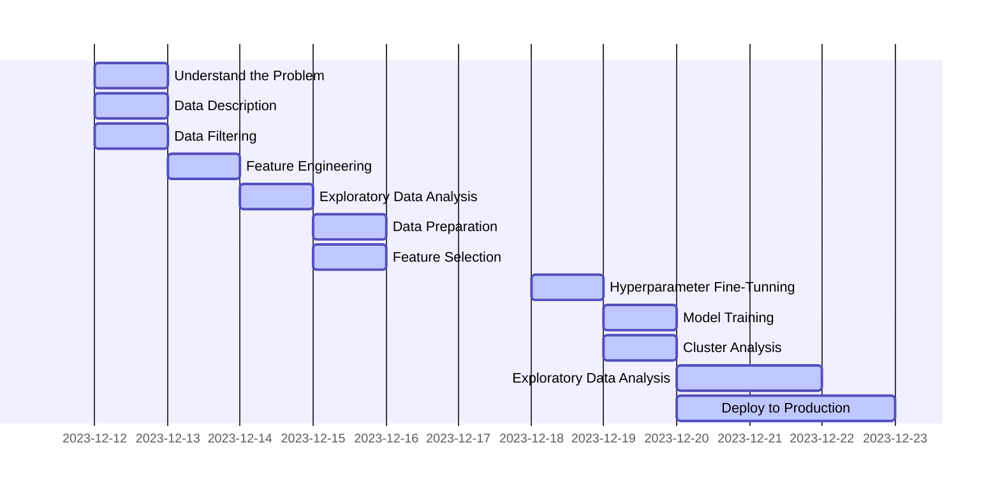

# High Value Customer Identification

## 1 Business Problem
- Determine which are the most valuable customers to form the **"INSIDERS" Loyalty Program**, with the aim of increasing revenue and purchase frequency.

| # | Business Questions | Success Criteria | Solution Format |
|---|--------------------|------------------|-----------------|
| 1 | Quais são os clientes elegíveis para o programa **Insiders?** | Alto LTV,   Alta Frequência,   Alto Basket Size,   Baixa probabilidade de Churn,   Previsão alta de LTV,   Alta propensão de compra,   Baixo número de devoluções,   Média alta de avaliações | |
| 2 | Quantos clientes farão parte do grupo? | Número de clientes,   % em relação ao total de clients | |
| 3 | Quais as principais características desses clientes? | Idade,   País,   Salário,   comportamentos de compra | |
| 4 | Qual a porcentagem de contribuição do faturamento, vinda do Insiders? | Calcular o faturamento total da empresa durante o ano,   Calcular o faturamento (%) apenas do programa Insiders | |
| 5 | Qual a expectativa de faturamento desse grupo para os próximos meses? | Cálculo do LTV do grupo Insiders,   Séries Temporais ( ARMA, ARIMA, HoltWinter, etc ) | |
| 6 | Quais as condições para um cliente ser elegível ao Insiders? | Qual o período de avaliação?,   O "desempenho" do cliente está próximo da média do cluster Insiders  | |
| 7 | Quais as condições para um cliente ser removido do Insiders? | O "desempenho" do cliente não está mais próximo da média do cluster Insiders | |
| 8 | Qual a garantia que o programa Insiders é melhor que o restante da base? | Teste de Hipóteses,   Teste A/B | |
| 9 | Quais ações o time de marketing pode realizar para aumentar o faturamento? | Descontos,   Preferências de escolha,   Produtos exclusivos | |

## 2 Solution Strategy

## 3 Data Description
### 3.1 Descriptive Statistics
| attributes | min | max | range | mean | median | std | skew | kurtosis |
|------------|-----|-----|-------|------|--------|-----|------|----------|
| attributes | min | max | range | mean | median | std | skew | kurtosis |

## 4 Feature Engineering
### 4.1 MindMap

### 4.2 Hypothesis Creation
| # | Store | Product | Time |
|---|-------|---------|------|
| 1 |  |  |  |
| 2 |  |  |  |
| 3 |  |  |  |
| 4 |  |  |  |
| 5 |  |  |  |
| 6 |  |  |  |
| 7 |  |  |  |

## 5 Exploratory Data Analysis
### 5.1 Univariate Analysis
#### 5.1.1 Response Variable

#### 5.1.2 Numerical Variable

#### 5.1.3 Categorical Variable

### 5.2 Hypothesis Validation
- h01 - aaa
    - TRUE/FALSE - ggggg

### 5.3 Multivariate Analysis
#### 5.3.1 Numerical Attributes

#### 5.3.2 Categorical Attributes

## 6 Machine Learning Model Applied
### 6.1 Compare Model's Performance
| Model Name | MAE CV | MAPE CV | RMSE CV |
|------------|--------|---------|---------|
| Model Name | MAE CV | MAPE CV | RMSE CV |

## 7 Performance Metrics
### 7.1 Business Performance
| store | predictions | worst_scenario | best_scenario | MAE | MAPE |
|-------|-------------|----------------|---------------|-----|------|
| store | predictions | worst_scenario | best_scenario | MAE | MAPE |

### 7.2 Total Performance

### 7.3 Machine Learning Performance

## 8 Deploy to Production 
- aaa

## 9 Next Sprint
- aaa
